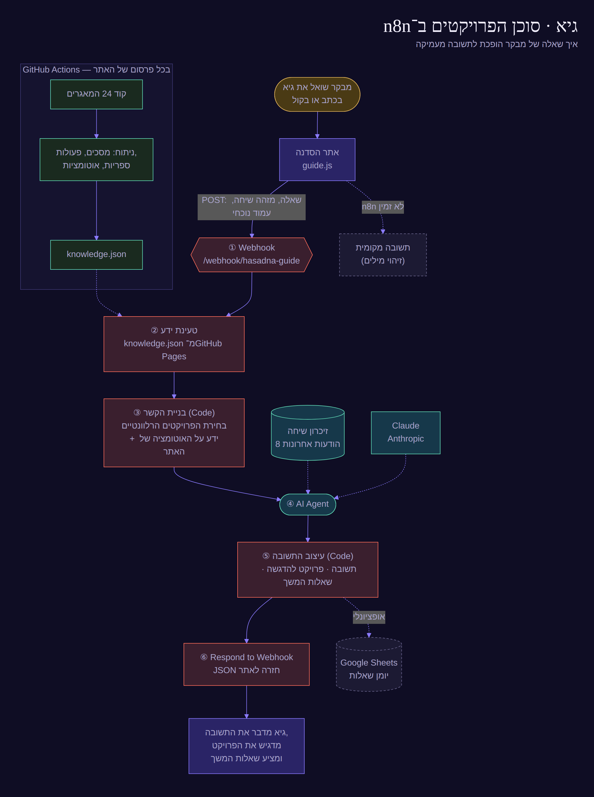

# n8n

בתיקייה שני Workflows מוכנים ל־n8n Cloud:

| קובץ | מה הוא |
| --- | --- |
| `hasadna-guide-agent.json` | **גיא — סוכן הפרויקטים** של אתר הסדנה (`portfolio/`). עונה לעומק על כל פרויקט ועל האוטומציות. |
| `masa-vacation-agent.json` | האתר, הדילים והסוכן של **מסע** (למטה). |

## גיא — סוכן הפרויקטים



מקור התרשים: `guide-flow.mmd` (Mermaid).

**איך זה עובד:**
1. **Webhook:** האתר שולח את השאלה, מזהה שיחה, והעמוד שהמבקר נמצא בו.
2. **טעינת ידע:** `portfolio/knowledge.json` מ־GitHub Pages. הקובץ נבנה אוטומטית בכל פרסום. GitHub Actions מוריד את הקוד של כל הפרויקטים ומחלץ ממנו מסכים, פעולות, ספריות ואוטומציות (Docker, שרתים, n8n, Excel, PDF, תזמון…).
3. **בניית הקשר:** צומת Code בוחר את הפרויקטים שהשאלה עוסקת בהם, ובשאלות על אוטומציה מוסיף את הפרויקטים העשירים באוטומציה ואת האופן שבו האתר עצמו מתעדכן.
4. **AI Agent:** Claude עם זיכרון של 8 ההודעות האחרונות בשיחה. בשאלה פשוטה הוא עונה בקצרה, ובשאלה מעמיקה ב־4–8 משפטים עם פרטים מהקוד.
5. **עיצוב התשובה:** מפריד את התשובה, את הפרויקט שצריך להדגיש באתר, ושתי שאלות המשך מעמיקות. באתר הן מופיעות ככפתורים.
6. **Respond:** מחזיר JSON לאתר. אפשר גם להפעיל יומן שאלות ב־Google Sheets.

אם n8n לא זמין, גיא עונה מהאתר עצמו בזיהוי מילים, כך שהאתר לא נשבר.

### התקנה (כ־5 דקות)
1. ב־n8n Cloud: **Create workflow** ← תפריט `⋯` ← **Import from File** ← `hasadna-guide-agent.json` ← **Save**.
2. פותחים את הצומת **Claude (Anthropic)** ← Credential ← **Create new** ← מדביקים API key מ־console.anthropic.com. אם שדה המודל אדום, בוחרים מהרשימה את Claude Opus העדכני.
3. מתג **Active** למעלה.
4. פותחים את **Guide · Webhook**, בלשונית **Production URL** מעתיקים את הכתובת (בסגנון `https://<שם>.app.n8n.cloud/webhook/hasadna-guide`).
5. מדביקים אותה בשדה `guideApi` בקובץ `portfolio/projects.json` (אפשר לערוך ישירות ב־GitHub), ושומרים. תוך 2 דקות גיא מחובר.

**בדיקה מהירה** (PowerShell):
```powershell
Invoke-RestMethod -Method Post -Uri "https://<שם>.app.n8n.cloud/webhook/hasadna-guide" -ContentType "text/plain" -Body '{"question":"איך האתר מתעדכן לבד?","sessionId":"test"}'
```

**בנייה מחדש:** `python3 n8n/build-guide-workflow.py` (אפשר `--model` אחר).

---

# מסע ב-n8n

הקובץ `masa-vacation-agent.json` הוא Workflow מוכן ל-n8n Cloud עם שלושה חלקים:

| חלק | כתובת (אחרי הפעלה) | מה הוא עושה |
| --- | --- | --- |
| **1 · האתר** | `https://<שם>.app.n8n.cloud/webhook/masa` | מגיש את האתר. ה-HTML נמשך מ-GitHub בכל בקשה — **תמיד מסונכרן** עם הריפו. |
| **2 · קבלת דילים** | `…/webhook/masa-deal` | דף "סגירת דיל" שולח לכאן את הדיל → מייל לסוכן (Gmail) → אופציונלי: שורה ב-Google Sheets. |
| **3 · הסוכן החכם** | `…/webhook/masa-chat` | הצ׳אט באתר מדבר עם סוכן AI (Claude) שעונה מתוך הידע של האתר (`api/knowledge.json`). |

## התקנה (פעם אחת, כ-5 דקות)

1. **ייבוא:** ב-n8n Cloud → **Create workflow** → תפריט `⋯` → **Import from File** → בוחרים `masa-vacation-agent.json` → **Save**.
2. **Gmail** (לדילים): לחיצה על הצומת **Deal · Email the agent (Gmail)** → Credential → **Create new** → Sign in with Google.
3. **Claude** (לסוכן): לחיצה על הצומת **Claude (Anthropic)** → Credential → **Create new** → מדביקים API key מ-console.anthropic.com. אם שדה המודל מסומן באדום — בוחרים מהרשימה מודל Claude עדכני.
4. **(אופציונלי) Google Sheets:** פותחים את **Deal · Log to Google Sheets**, מחברים חשבון, מדביקים קישור לגיליון עם לשונית `Deals`, ומבטלים את ההשבתה (Deactivate → Activate, מקש `D`).
5. **הפעלה:** מתג **Active** למעלה מימין.
6. פותחים את `https://<שם>.app.n8n.cloud/webhook/masa` — זה האתר, מחובר לדילים ולסוכן.

## חיבור האתר ב-GitHub Pages ל-n8n

כשהאתר נפתח מ-n8n (שלב 6) הוא מתחבר לבד. כדי שגם האתר ב-GitHub Pages ישלח דילים וצ׳אט ל-n8n, ממלאים ב-`vacation-hub/js/config.js`:

```js
n8n: { base: 'https://<שם>.app.n8n.cloud/webhook', deal: 'masa-deal', chat: 'masa-chat' },
```

אם n8n לא זמין — האתר ממשיך לעבוד: הצ׳אט עונה עם העוזר המקומי, והדיל נשלח בוואטסאפ.

## סנכרון

- **האתר:** כל שינוי שנכנס ל-`main` → GitHub Pages מתעדכן תוך 1–2 דק׳ → n8n מגיש את הגרסה החדשה (עד ~5 דק׳ מטמון של GitHub).
- **הידע של הסוכן:** `api/knowledge.json` נבנה אוטומטית מקבצי הנתונים בכל פרסום — הוספת יעד/מלון באתר = הסוכן יודע עליו.
- **ה-Workflow עצמו:** נשמר בריפו כקובץ JSON. אחרי שינוי ב-n8n: `⋯` → **Download** ומחליפים את הקובץ כאן, כדי שיהיה גיבוי והיסטוריה ב-Git.

## הרחבת הסוכן בעתיד

רעיונות שמתחברים ישירות לצומת **AI Agent** בחלק 3 (ב-n8n: `+` מתחת ל-Tool):
- **חיפוש טיסות/מלונות בזמן אמת** — HTTP Request Tool ל-API של Amadeus / Duffel / Travelpayouts.
- **יומן** — Google Calendar Tool לקביעת שיחה עם הסוכן.
- **CRM** — שמירת לידים ב-Google Sheets / Airtable / HubSpot מתוך השיחה.
- **וואטסאפ עסקי** — WhatsApp Business Cloud כערוץ נוסף לאותו סוכן.
- **מעקב דילים** — תזכורות אוטומטיות (Schedule Trigger) ללקוחות שלא סגרו.

## בנייה מחדש (למפתחים)

```bash
node n8n/build-knowledge.mjs vacation-hub          # api/knowledge.json
python3 n8n/build-workflow.py --owner devopsdevopshaim-wq --repo devops-hub \
  --brand "מסע" --email devopsdevopshaim@gmail.com  # n8n/masa-vacation-agent.json
```
