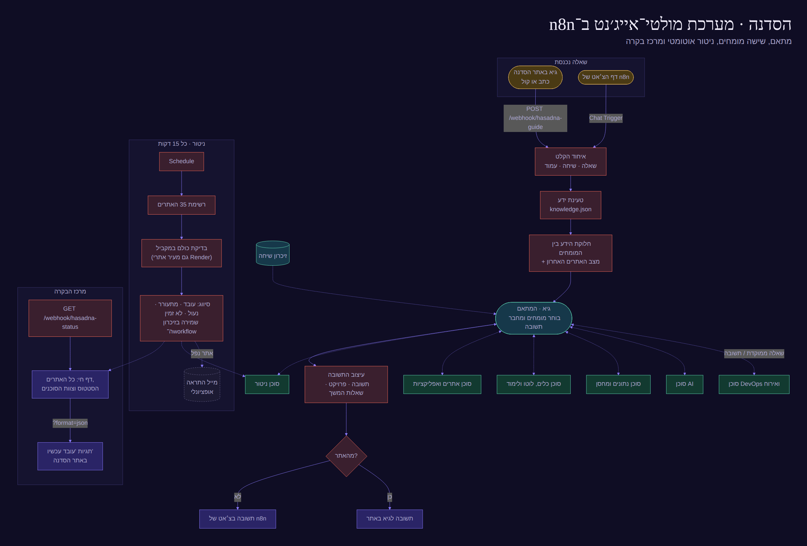

# n8n

בתיקייה שני Workflows מוכנים ל־n8n Cloud:

| קובץ | מה הוא |
| --- | --- |
| `hasadna-multi-agent.json` | **מערכת המולטי־אייג׳נט של SPIDER**: מתאם + 6 סוכנים מומחים, ניטור של כל האתרים כל 15 דקות, ומרכז בקרה חי. |
| `masa-vacation-agent.json` | האתר, הדילים והסוכן של **מסע** (למטה). |

## אבטחה

כל ה־webhooks הציבוריים של SPIDER (כניסה, לידים ומחירון, מאיה, קול) עוברים אותה שכבת הגנה, שנמצאת ב־`snippets/security.js` ונבדקת ב־`test/`:

| איום | הגנה |
| --- | --- |
| אתר זר שפונה ל־n8n מהדפדפן של מישהו | רק האתר עצמו (Origin) מורשה. כל השאר מקבל 403, וכותרת ה־CORS אינה `*` יותר. |
| ניחוש קודים וכוח גס | 5 ניסיונות לקוד, 10 בשעה לכתובת, אחר כך נעילה לשעה והתראה במייל למנהל. |
| הצפה (מיילים, לידים, הוצאות Claude וקול) | הגבלת קצב לכל כתובת ותקרה כללית ליום. שאלות למאיה: 15 בשעה לכתובת ו־200 ביום. |
| דליפת מסד הנתונים של n8n | קודי כניסה וטוקנים נשמרים רק כ־hash (SHA-256). מפתחות (Morning, Azure, ElevenLabs, TOTP) נכנסים בזמן ההתקנה מהסוד `SPIDER` ואינם בקוד. |
| פריצה למייל של המנהל | אימות דו־שלבי באפליקציה (TOTP): `portfolio/admin-2fa.html` יוצר מפתח, ומוסיפים אותו כ־`ADMIN_TOTP_SECRET` בסוד `SPIDER`. כניסת מנהל תקפה ל־12 שעות. |
| השתלטות על מסך הלידים והמחירון | אין יותר סיסמה נפרדת. הכניסה הראשית מנפיקה למנהל הוכחה חתומה ל־30 דקות, והמסך בודק אותה בחישוב בלבד. |
| שימוש לרעה במאיה (Claude) | הצ׳אט הציבורי של n8n כבוי; הוראות נגד הזרקת פרומפטים; מאיה לא חושפת מפתחות או פרטי לקוחות. |
| טעות בהתקנה | בכל התקנה רצות 200+ בדיקות. כישלון עוצר את ההתקנה. אחריה נבדקות הדלתות מבחוץ (ראו את הסיכום ב־Actions). |

מה שהאבטחה הזו **לא** יכולה לתת: האתר עצמו סטטי ב־GitHub Pages, ולכן קבצי האתר נשארים ציבוריים. הכניסה מסתירה את הממשק ואת המידע שנשמר ב־n8n, אך לא את הקבצים עצמם. נעילה מלאה דורשת שירות מקדים כמו Cloudflare Access.

סודות שחובה להחליף אם הוצגו או נשלחו בצ׳אט: מפתח ה־API של n8n, סיסמת האפליקציה של Gmail, ומפתח האימות הדו־שלבי.

## SPIDER · מערכת מולטי־אייג׳נט ומרכז בקרה



מקור התרשים: `multi-agent-flow.mmd`. הקובץ נבנה עם `python3 n8n/build-multi-agent-workflow.py`.

**שלושה חלקים ב־workflow אחד:**

1. **צוות הסוכנים.** שאלה מגיעה מגיא באתר (`/webhook/hasadna-guide`) או מדף הצ׳אט של n8n.
   - **גיא · המתאם** מחליט אילו מומחים לשאול, שולח לכל אחד שאלה ממוקדת, ומחבר תשובה אחת עם פרויקט להדגשה ושאלות המשך.
   - המומחים (כל אחד הוא AI Agent עם Claude משלו): **DevOps ואירוח**, **AI**, **נתונים ומחסן**, **כלים, לוטו ולימוד**, **אתרים ואפליקציות**, ו**ניטור**.
   - כל מומחה מקבל את הידע על הפרויקטים שלו מ־`knowledge.json`, שנבנה אוטומטית מהקוד בכל פרסום. זה כולל מסכים, פעולות, ספריות ואוטומציות.
2. **ניטור.** כל 15 דקות n8n בודק את כל האתרים במקביל ומסווג כל אחד: עובד, מתעורר, נעול או לא זמין. התוצאה נשמרת בזיכרון ה־workflow, והבדיקה גם מעירה אתרי Render שנרדמו. אפשר להפעיל מייל התראה כשאתר נופל.
3. **מרכז הבקרה.** `https://<שם>.app.n8n.cloud/webhook/hasadna-status` הוא דף חי שמציג:
   - כל האתרים עם צילום מסך, סטטוס וקוד HTTP;
   - צוות הסוכנים;
   - קישור לצ׳אט וכפתור "בדיקה עכשיו".

   אתר SPIDER קורא את אותו דף (`?format=json`) ומציג על כל כרטיס "עובד עכשיו" או "לא זמין כרגע".

### התקנה אוטומטית מ־GitHub (מומלץ)

GitHub Action בשם **Deploy agents to n8n Cloud** מתקין הכול דרך ה־API של n8n:
1. יוצר ב־n8n את ה־credential של Claude.
2. יוצר או מעדכן את ה־workflow ומפעיל אותו.
3. מחבר את גיא ואת מרכז הבקרה לאתר.

**פעם אחת**, ב־GitHub ← devops-hub ← **Settings** ← **Secrets and variables** ← **Actions** ← **New repository secret**, מוסיפים שלושה סודות:

| שם | ערך |
| --- | --- |
| `N8N_URL` | הכתובת של n8n שלכם, למשל `https://haim.app.n8n.cloud` (בלי `/` בסוף) |
| `N8N_API_KEY` | ב־n8n: **Settings** ← **n8n API** ← **Create an API key** |
| `ANTHROPIC_API_KEY` | מפתח מ־console.anthropic.com. נדרש רק בהתקנה הראשונה. |

אחר כך: **Actions** ← **Deploy agents to n8n Cloud** ← **Run workflow**. בסיום, סיכום הריצה מציג את הקישור למרכז הבקרה. מכאן והלאה, כל שינוי בקובץ ה־workflow ב־GitHub מתעדכן ב־n8n לבד.

המפתחות נשמרים כסודות ב־GitHub, ואף אחד (כולל Claude) לא רואה אותם.
ה־API של n8n לא זמין בתקופת הניסיון החינמית של n8n Cloud. במקרה כזה, משתמשים בהתקנה הידנית.

### התקנה ידנית (אם אין API)
1. ב־n8n Cloud: **Create workflow** ← `⋯` ← **Import from File** ← `hasadna-multi-agent.json` ← **Save**.
2. בכל אחד משבעת צומתי **Claude** בוחרים Credential של Anthropic. בפעם הראשונה בוחרים **Create new** ומדביקים את המפתח, ובשאר פשוט בוחרים אותו.
3. **Active** למעלה.
4. מעתיקים את ה־Production URL של **Guy · Site webhook** ושל **Status · Webhook** לשדות `guideApi` ו־`statusUrl` בקובץ `portfolio/projects.json`.

### בדיקה
- מרכז הבקרה: פותחים את `…/webhook/hasadna-status?run=1` בדפדפן.
- הצ׳אט: לוחצים על "שיחה עם צוות הסוכנים" במרכז הבקרה.
- גיא באתר: שואלים אותו "איך האתר מתעדכן לבד?".

---

# מסע ב-n8n

הקובץ `masa-vacation-agent.json` הוא Workflow מוכן ל-n8n Cloud עם שלושה חלקים:

| חלק | כתובת (אחרי הפעלה) | מה הוא עושה |
| --- | --- | --- |
| **1 · האתר** | `https://<שם>.app.n8n.cloud/webhook/masa` | מגיש את האתר. ה-HTML נמשך מ-GitHub בכל בקשה — **תמיד מסונכרן** עם הריפו. |
| **2 · קבלת דילים** | `…/webhook/masa-deal` | דף "סגירת דיל" שולח לכאן את הדיל → מייל לסוכן (Gmail) → אופציונלי: שורה ב-Google Sheets. |
| **3 · הסוכן החכם** | `…/webhook/masa-chat` | הצ׳אט באתר מדבר עם סוכן AI (Claude) שעונה מתוך הידע של האתר (`api/knowledge.json`). |

## התקנה (פעם אחת, כ-5 דקות)

1. **ייבוא:** ב-n8n Cloud → **Create workflow** → תפריט `⋯` → **Import from File** → בוחרים `masa-vacation-agent.json` → **Save**.
2. **Gmail** (לדילים): לחיצה על הצומת **Deal · Email the agent (Gmail)** → Credential → **Create new** → Sign in with Google.
3. **Claude** (לסוכן): לחיצה על הצומת **Claude (Anthropic)** → Credential → **Create new** → מדביקים API key מ-console.anthropic.com. אם שדה המודל מסומן באדום — בוחרים מהרשימה מודל Claude עדכני.
4. **(אופציונלי) Google Sheets:** פותחים את **Deal · Log to Google Sheets**, מחברים חשבון, מדביקים קישור לגיליון עם לשונית `Deals`, ומבטלים את ההשבתה (Deactivate → Activate, מקש `D`).
5. **הפעלה:** מתג **Active** למעלה מימין.
6. פותחים את `https://<שם>.app.n8n.cloud/webhook/masa` — זה האתר, מחובר לדילים ולסוכן.

## חיבור האתר ב-GitHub Pages ל-n8n

כשהאתר נפתח מ-n8n (שלב 6) הוא מתחבר לבד. כדי שגם האתר ב-GitHub Pages ישלח דילים וצ׳אט ל-n8n, ממלאים ב-`vacation-hub/js/config.js`:

```js
n8n: { base: 'https://<שם>.app.n8n.cloud/webhook', deal: 'masa-deal', chat: 'masa-chat' },
```

אם n8n לא זמין — האתר ממשיך לעבוד: הצ׳אט עונה עם העוזר המקומי, והדיל נשלח בוואטסאפ.

## סנכרון

- **האתר:** כל שינוי שנכנס ל-`main` → GitHub Pages מתעדכן תוך 1–2 דק׳ → n8n מגיש את הגרסה החדשה (עד ~5 דק׳ מטמון של GitHub).
- **הידע של הסוכן:** `api/knowledge.json` נבנה אוטומטית מקבצי הנתונים בכל פרסום — הוספת יעד/מלון באתר = הסוכן יודע עליו.
- **ה-Workflow עצמו:** נשמר בריפו כקובץ JSON. אחרי שינוי ב-n8n: `⋯` → **Download** ומחליפים את הקובץ כאן, כדי שיהיה גיבוי והיסטוריה ב-Git.

## הרחבת הסוכן בעתיד

רעיונות שמתחברים ישירות לצומת **AI Agent** בחלק 3 (ב-n8n: `+` מתחת ל-Tool):
- **חיפוש טיסות/מלונות בזמן אמת** — HTTP Request Tool ל-API של Amadeus / Duffel / Travelpayouts.
- **יומן** — Google Calendar Tool לקביעת שיחה עם הסוכן.
- **CRM** — שמירת לידים ב-Google Sheets / Airtable / HubSpot מתוך השיחה.
- **וואטסאפ עסקי** — WhatsApp Business Cloud כערוץ נוסף לאותו סוכן.
- **מעקב דילים** — תזכורות אוטומטיות (Schedule Trigger) ללקוחות שלא סגרו.

## בנייה מחדש (למפתחים)

```bash
node n8n/build-knowledge.mjs vacation-hub          # api/knowledge.json
python3 n8n/build-workflow.py --owner devopsdevopshaim-wq --repo devops-hub \
  --brand "מסע" --email devopsdevopshaim@gmail.com  # n8n/masa-vacation-agent.json
```

## לידים ומחירון (`hasadna-business.json`)

Workflow נפרד לעסק. אין בו שום חיבור שצריך להגדיר מראש: הכול נשמר בזיכרון של ה־workflow.

| כתובת | מה עושה |
|---|---|
| `POST /webhook/hasadna-lead` | דף השירותים שולח לכאן כל ליד, וגם סופר לחיצות על וואטסאפ |
| `GET /webhook/hasadna-prices` | דף השירותים קורא מכאן את המחירים והמבצעים שקבעת |
| `POST /webhook/hasadna-admin` | מסך הניהול: לידים, סטטוסים, הערות ושמירת מחירון. דורש סיסמת מנהל |

הפעלה:
1. ב־n8n: **Workflows ← Import from File ← `n8n/hasadna-business.json`**.
2. מפעילים את המתג **Active**.
3. במסך הניהול של האתר (`portfolio/admin.html#biz`) בוחרים סיסמה. מעכשיו רק מי שיודע אותה רואה לידים ומשנה מחירים.

כל ליד חדש נשלח גם במייל (צומת **Lead · Email**, דרך חיבור `SPIDER · Gmail`). גם צומת **Alert · Email** במרכז הבקרה שולח מייל כשאתר מפסיק לעבוד.
שכחת את הסיסמה? כותבים סיסמה חדשה ב־`ADMIN_KEY` בצומת **Admin · Handle**.
לשנות את המבנה: `python3 n8n/build-business-workflow.py`.

## Parkomat · סוכני חניון רובוטי (`hasadna-parkomat.json`)

הסוכנים שעונים על השאלונים באתר פארק־פלאן (`robotic-parking/`, אזור «שאלונים»).

| כתובת | מה עושה |
|---|---|
| `POST /webhook/parkomat-agents` | מקבל שאלון (יזם, טכני או שאלה חופשית) עם תצורת החניון, ומחזיר `{answer, kind}` |
| `POST /webhook/parking-agents` | העלאת קובץ (multipart: `file`, `department`, `destination` = drive / slack, `message`). מחליף את ה־n8n המקומי (`localhost:5679`) |

איך זה עובד:
- **Parkomat · מתאם** מקבל את התשובות לשאלון, את ההמלצה המיידית שהאתר חישב, ואת התצורה הנוכחית במתכנן.
- הוא מתייעץ עם שלושה סוכנים מומחים: **תכנון וקיבולת** (קומות, תאים, מעליות, זמני שליפה), **חשמל, בקרה ובטיחות** (ארונות, דרייברים, PLC, PROFIsafe, כיבוי ואוורור), ו**יזמות ורישוי** (תקציב, לוחות זמנים, היתרים).
- התשובה חוזרת לאתר בעברית: המלצה, מספרים, סיכונים וצעדים הבאים.
- כשממלאים טלפון או מייל, נשלח ליד ל־devopsdevopshaim@gmail.com (צומת **Lead · Email**, חיבור `SPIDER · Gmail`).
- האתר תמיד מציג קודם תשובה מיידית שמחושבת אצלו. אם הסוכנים לא זמינים, נשארת התשובה המיידית.

העלאת קבצים (`parking-agents`), מהאתר של Parkomat ומלשונית «קובץ ל־Parkomat» בפארק־פלאן:
- **Files · בודק** (Claude) קורא את הקובץ (תוכן טקסט עד 300KB, אחרת שם וסוג) וכותב סיכום קצר.
- הקובץ עובר ל־**Drive · Upload** או ל־**Slack · Upload** לפי היעד, ועותק עם הסיכום תמיד נשלח במייל (**Files · Email**).
- **חד־פעמי ב־n8n:** לחבר חשבון Google בצומת Drive · Upload, וחשבון Slack עם ערוץ בצומת Slack · Upload. שני הצמתים מגיעים כבויים (n8n לא מפרסם צומת פעיל בלי חשבון). אחרי החיבור מריצים את Action **Deploy agents to n8n Cloud**, והוא מפעיל אותם ושומר את החיבורים. עד שמחברים, הקבצים מגיעים במייל בלבד והתשובה אומרת זאת.
- בלי סיסמה ובלי שרת מקומי. מגבלה: 15MB לקובץ.

התקנה: אוטומטית, יחד עם שאר הסוכנים, בכל דחיפה ל־main (Action: **Deploy agents to n8n Cloud**).
כתובת אחרת לסוכנים: באתר מריצים `localStorage.setItem('rp-parkomat-url','https://…/webhook/…')`.
לשנות את המבנה: `python3 n8n/build-parkomat-workflow.py`.

## כניסה והרשאות (`hasadna-access.json`)

מי נכנס לאתר ומה כל אחד רואה. הכתובת היא `POST /webhook/hasadna-auth`.

- **כניסה:** מייל, טלפון וקוד חד־פעמי בן 6 ספרות. הקוד נשלח כרגע במייל, ובהמשך גם בוואטסאפ.
- **המנהל:** מוגדר בראש הצומת **Auth · Handle** (`ADMIN_EMAIL`, `ADMIN_PHONE`). הוא רואה הכול, והכניסה שלו נשמרת 30 יום.
- **לקוח:** רואה רק את האתרים שסימנת לו, עד סוף המנוי (יומי, שבועי, חודשי, שנתי או תאריך שאתה קובע). השהיה או מחיקה חוסמות אותו מיד.
- **ניהול:** את הלקוחות מנהלים במסך הניהול, בחלק "לקוחות". שם גם יומן הכניסות וכפתור "הזמנה בוואטסאפ".

הפעלה:
1. ב־n8n: **Import from File ← `n8n/hasadna-access.json`**.
2. פותחים את הצומת **Send · Email** ומחברים את חשבון ה־Gmail (Sign in with Google).
3. מפעילים את המתג **Active**.

### תשלומים וחשבוניות

במסך הניהול, ליד כל לקוח, יש כפתור **💳 תשלום**. הוא רושם את התשלום ומאריך את המנוי.
אם מסמנים "להפיק חשבונית", המערכת יוצרת מסמך ב־**Morning (חשבונית ירוקה)** ושולחת ללקוח במייל קישור אליו.

חיבור, פעם אחת:
1. ב־Morning נכנסים ל**הגדרות ← כלי מפתחים ← API** ויוצרים מפתח (client id ו־client secret).
2. ב־n8n, בראש הצומת **Auth · Handle**, ממלאים את `INVOICE`:
   - `clientId` ו־`clientSecret`;
   - `docType`: ‏320 (חשבונית מס/קבלה, עוסק מורשה) או 400 (קבלה, עוסק פטור).


## התקנה אוטומטית של הכול מ־GitHub (מומלץ)

‏GitHub Action ‏**Deploy agents to n8n Cloud** מתקין את שלושת ה־workflows, מחבר אותם, מפעיל, ובודק שהם עונים.

סודות ב־GitHub, תחת **Settings ← Secrets and variables ← Actions ← New repository secret**:

| שם | ערך |
|---|---|
| `N8N_URL` | `https://haimkripisn.app.n8n.cloud` |
| `N8N_API_KEY` | מ־n8n: ‏Settings ← n8n API ← Create an API key |
| `GMAIL_APP_PASSWORD` | מ־Google: ‏myaccount.google.com/apppasswords (צריך אימות דו־שלבי) |
| `ANTHROPIC_API_KEY` | רק אם אין עדיין חיבור Claude ב־n8n |

אחר כך: **Actions ← Deploy agents to n8n Cloud ← Run workflow**.

הלידים, המחירון והלקוחות שכבר שמורים לא נמחקים בעדכון.
כדי לבדוק את הכניסה לפני שהיא ננעלת לכולם, נכנסים ל־`admin.html?login=1`.
